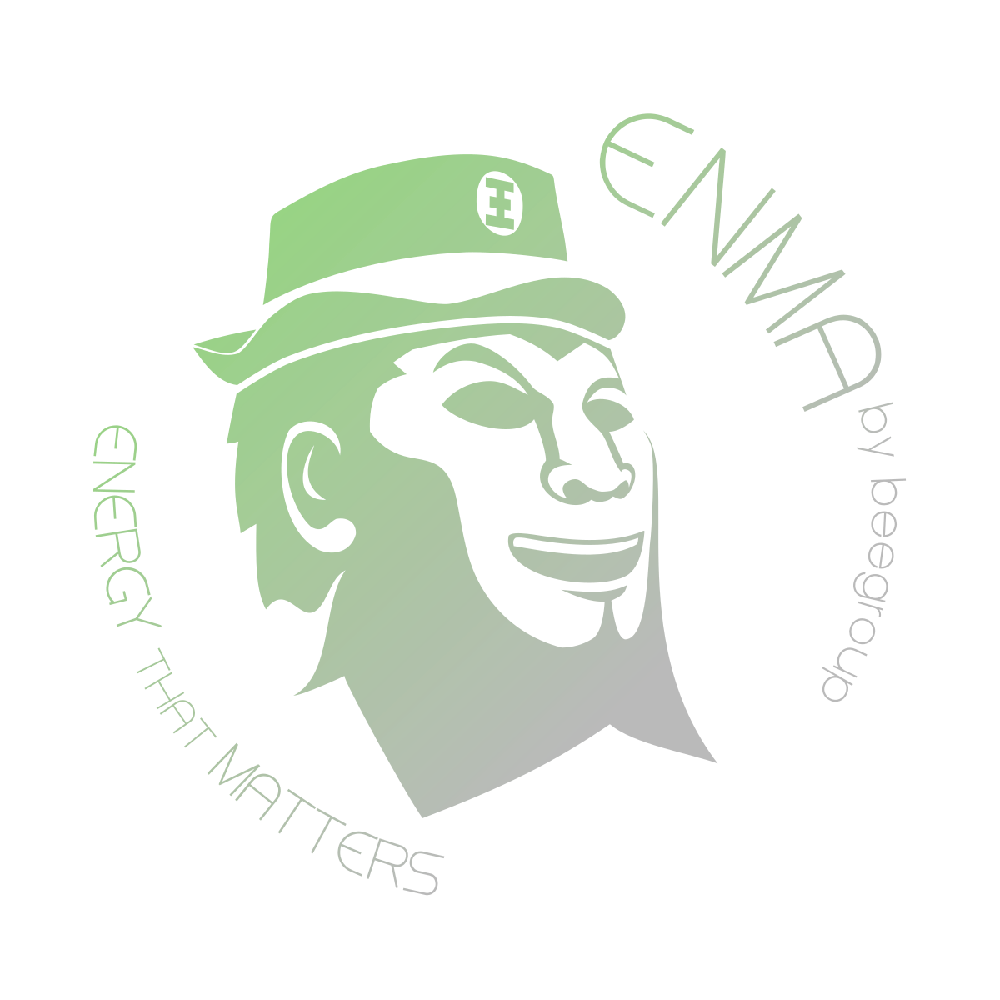

# ENMA Big Data Platform

The ENMA platform was developed by CIMNE and it is a Big Data software which allows to storage, manage and analyze high amounts of information.

## The origin of ENMA

ENMA was initially developed within the EMPOWERING project, which aimed at help consumers to save energy thanks to the information on their meter or bill. It was a co-founded project by the Intelligent Energy Europe Programme of the European Union.

**Main objectives of the project**

The overall aim of the project is to empower and aware consumers by involving, informing and helping them to take measures to save energy on the basis of their consumption meters or energy bills. This aim can be translated in to three general objectives:

- Achieving measurable energy savings (absolute savings and also peak demand reduction).
- Increasing awareness and motivation of consumers with respect to energy efficiency.
- Increasing trust between consumers and energy suppliers as a pre‐requisite for increasing energy performance for mutual benefit.

## Documentation index

Following is the structure of this documentation.

1. **[Architecture of the platform](architecture/system_architecture.md)**
2. **[Task definition](modules/workflow.md)**

[comment]: <> (3. ~~**[Documentation for module developers]&#40;developers/developers.md&#41;**~~ &#40;Not Updated&#41;)
4. **[Installing architecture](enma_code/installing.md)**

## Authors
- Jose Manuel Broto - jmbroto@cimne.upc.edu
- Gerard Mor - gmor@cimne.upc.edu
- Jordi Cipriano - cipriano@cimne.upc.edu
- Eloi Gabaldón - egabaldon@cimne.upc.edu
- Josep Mayos - jmayos@cimne.upc.edu
- Jordi Carbonell - jordi@cimne.upc.edu
- Daniel Pérez - sanchez@cimne.upc.edu
- Núria Salvador - nsalvador@cimne.upc.edu
- Arián Huapaya  - ahuapaya@cimne.upc.edu
- Andreu Marí - amari@cimne.upc.edu
- Gerard Laguna - glaguna@cimne.upc.edu
- Stoyan Danov - sdanov@cimne.upc.edu
  
Copyright (c) 2024 Jose Manuel Broto, Gerard Mor, Jordi Cipriano, Eloi Gabaldón, Josep Mayos, Jordi Carbonel, Daniel Pérez, Nuria Salvador, Arian Huapaya, Andreu Marí, Gerard Laguna, Stoyan Danov 
   
