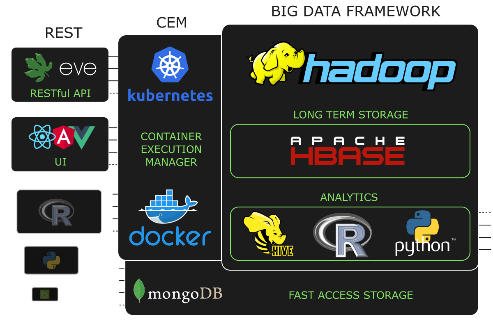

# ENMA - Architecture of the platform

[Return home](../README.md)

ENMA have been designed as an scalable architecture, combinign different components that will orchestrate the whole set. The following documentation describes the most important componets that interact in the plataform.

### Container Execution Manager

This component will be in charge to run and manage all the different general purpose containers: 
    
- Asynchronous task that will execute the different steps of a Data Analytics Module.
- API (REST) to provide data access to applications
- Final web user interfaces.

To be able to manage all these containers, this component is powered by a **Kubernetes** cluster, where all the previous components must be implemented inside a **docker**.

> In this architecture, a task is a set of instructions: queries to databases, data transformations , model training, etc. That analyze the stored data or transforms it.

### Fast Access Storage

This component is the main database for the different API and users interfaces. This database is intended to store all required
input and output information provided by **MongoDB** (NoSQL).

This database is the key for many processes in the architecture, so we must ensure it is heavily resilient to data loss or downtimes.

### Data Analytics

Hadoop is the Big Data framework used in this architecture. With its components (some described below) we will be able to develop scalable modules operating in a distributed way, using the Map-Reduce paradigm.

**HDFS**:

Hadoop Distributed FileSystem (HDFS). Is the FS where Hadoop components work (like HBase or Hive).

We can see HDFS as regular Hard Drive, distributed in a cluster and some advantages

  - Main "support" for Map-Reduce, Hive, HBase to work (even a job without output it may need to write some temporary data)

  - Replication is enabled

  - Any node in a cluster can access all information stored in other nodes

  - High Availability

There are 2 main components to make HDFS work

- NameNode: a master server that manages the file system namespace and regulates access to files by clients

- DataNodes: n slave servers (usually 1 per node on the cluster) who manage storage attached to the nodes that they run on

**HBase**

Its our long-term database, which means that is a distributed and scalable database where we can store "old" data without loosing access to read/write on them.

HBase is a random access database capable of holding billions of rows with real time access. You can think its a key-value database, where given a Key you retrieve a Value (where the value is a structure of column families and columns)

From the architecture point of view there are 2 main components:

  - **Master**: the Master server is responsible for monitoring all RegionServer instances in the cluster, and is the interface for all metadata changes

  - **RegionServer**: it is responsible for serving and managing regions (which are the basic element of availability and distribution for tables, compromised per Column Family)

**Hive**

Data warehouse we can bind to HBase and HDFS files.

What Hive does is to "transform" the query into Map Reduce jobs so it may have some limitations with other SQL languages (because it's not possible to translate the query into a Map Reduce job or because it is not developed yet - despite an user can define its functions, called UDP -) and some functions may miss. Refer to its [hive documentation site](https://cwiki.apache.org/confluence/display/Hive/LanguageManual+UDF) to see a list of built-in functions

The architecture of Hive just consists on:

  - **Hive-server**: server interface that enables remote clients to execute queries against Hive

  - **Metastore**: keeps metadata information of Hive tables and partitions (on standalone setup a derby built-in metastore can be used)
