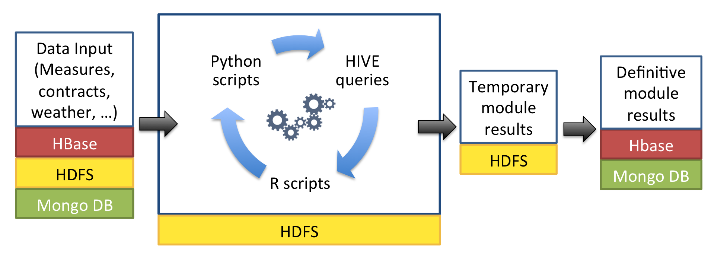

# ENMA - Analytical modules workflow

[Return home](../README.md)

## 1. General description of the structure of a ENMA task

A task will be implemented as a docker container. Each task needs all the required dependencies to run the application. 

An ENMA task consists on a veriety of execution:

### 1.1 Type of tasks
- User interfaces: Provides an application client for the users to interact with the system.
- API or Communication layers: Provides a communication layer between systems.
- Isolated tasks or analytics: Runs some task/analytics module defined in an isolated container
- Big data task or analytics: Runs some task/analytics module that makes use of the Hadoop Big data architecture.

### 1.2 Big data tasks
The following picture shows the workflow of a Big Data task running in the ENMA platform. The main idea is that the main 
container prepares the data in the system and runs the tasks in the Big Data architecture.

In general, the most common subtasks are HIVE queries, R scripts or Python scripts. In the next paragraphs, a brief description of each of them is made.

**HIVE queries**

HIVE is used as to access and query the data warehouse in a language similar to SQL (HiveQL), the raw or pretreated data stored in HBase or HDFS. The HIVE results generated are saved always as text files in the HDFS. In order to reduce at maximum the input dimensionality on subsequent subtasks, some basic calculations of the initial data are usually made in this queries (e.g. aggregations, products, counts, average calculations).

**R scripts**

This software is broadly used by data scientists to make sense of data using statistics or machine learning algorithms. This allows the developers to use all the existing R functions in a big data environment.
**Python scripts**

Python is broadly used by data scientists. There exists plenty of data mining libraries such as Numpy, Pandas or Scipy. This type of subtask is also very useful to read and write to MongoDB or HBase.

**Others**

The subtasks descriebed above are the among the most common in the developement of moules, however, the developer can decide to use other technologies by creating a valid docker for the platform.
